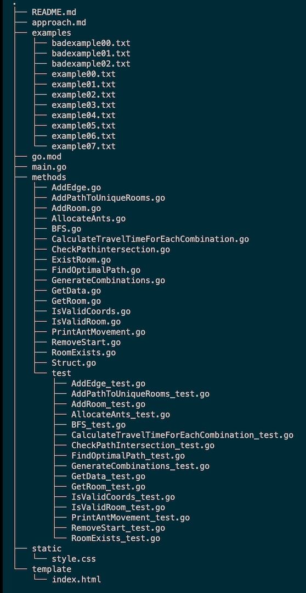

<a href="https://www.buymeacoffee.com/Pinkish-Warrior" target="_blank">

# LEM-IN 🎬 

## An Ant Movement Optimization 🐜 🔄

## Introduction 🤝

We have been tasked with creating a program that optimizes the movement of ants in a graph-based environment. The program should read input data from a file, construct a graph, find optimal paths for ants to move through the graph, allocate ants to paths, and output the movement of ants in a human-readable format.

## Requirements 📝

- 👉 Read Input:

Read input data from a specified file.
The input data includes:
The number of ants.
The names of the start and end rooms.
A list of rooms with their coordinates.
A list of links between rooms.

- 👉 Graph Construction:

Construct a graph representation from the provided input data.
Each room has a unique name and coordinates (X, Y).
Rooms are connected by links.
Optimal Path Finding:

Implement a path-finding algorithm to find all possible paths between the start and end rooms.
Determine the optimal path based on the number of ants and path lengths.

- 👉 Ant Allocation:

Allocate ants to paths in a way that minimizes the total travel time.
Each ant should traverse one path from start to end.

- 👉 Movement Output:

Print the movement of ants along the optimal paths.
Implement two output options:
Print ants' movements over time steps.
Print ants' migration in a single step.

- 👉 Code Organization:

Organize the code into modular functions with clear responsibilities.
Use meaningful variable and function names.
Implement error handling and informative error messages.

- 👉 Testing and Validation:

Implement unit tests to validate the functionality of your functions.
Provide example input files and expected output for testing purposes.

## Approach 🔍

BSF

## Resources 📚

- [LEM-IN: Previous Project](https://github.com/Dias1c/lem-in)
- [LEM-IN: Medium](https://medium.com/@jamierobertdawson/lem-in-finding-all-the-paths-and-deciding-which-are-worth-it-2503dffb893)

- [Dijkstra’s Shortest Path Algorithm](https://www.youtube.com/watch?v=pVfj6mxhdMw)
- [Dijkstra's Shortest Path Algorithm Explained](https://www.youtube.com/watch?v=bZkzH5x0SKU) 🔑
- [Edmonds-Karp](https://youtu.be/RppuJYwlcI8) 🔑

## Setup 🛠️

Input Format:

```
<number_of_ants>
<start_room_name>
<end_room_name>
<room_name_1> <x_coordinate> <y_coordinate>
<room_name_2> <x_coordinate> <y_coordinate>
...
<link_start_room_name_1>-<link_end_room_name_1>
<link_start_room_name_2>-<link_end_room_name_2>
...
```

Output Format:

Ant movements should be printed in a human-readable format.
For each time step, print the room each ant is in.
The output format should include either steps or a single migration.
Example Input:

```
5
##start
##end
room1 0 0
room2 1 0
room3 1 1
start-room1
room1-room2
room2-room3
room3-end
Example Output:
(Time steps format)

L1-start L2-start L3-start L4-start L5-start
L1-room1 L2-room1 L3-room1 L4-room1 L5-room1
L1-room2 L2-room2 L3-room2 L4-room2 L5-room2
L1-room3 L2-room3 L3-room3 L4-room3 L5-room3
L1-end L2-end L3-end L4-end L5-end
```

## How To Run 👣

```
./run_examples.sh
```

# TESTS 🧪

This document provides an explanation of the test cases for all methods in the `lem` package.

## Testing Go Code and Generating Coverage Reports 🔗:

Testing your Go code is crucial to ensure its correctness and reliability. In addition to running tests, generating coverage reports helps to understand how much of your code is covered by the tests. This guide will walk you through running tests, generating coverage reports, and viewing them in HTML format.

### Tree structure 🌿



## Running Tests 🔬

To run tests for your Go code, follow these steps:

**Open Terminal or Command Prompt:**

```sh
ctrl + `
```

**Navigate to Project Directory:**

Use the `cd` command to navigate to the root directory of your project, where the file containing all the functions and the `test` directory are located.

```sh
cd methods
```

**Run Test Commands** :

- Clean up test cache and produce a report combo:

```sh
go clean -testcache && go test -race -p 1 -coverpkg=./... ./... -coverprofile=coverage.out
```

- Produce a report:

```sh
go test -race -p 1 -coverpkg=./... ./... -coverprofile=coverage.out
```

- Check pass marks and test speed run:

```sh
go test ./test -v
```

- check all test in a html format:

```sh
go tool cover -html=coverage.out
```

## Conclusion ✅

These test cases cover various scenarios to ensure the correctness and reliability of all functions in the `lem` package.

[](https://pkg.go.dev/net/http)

## Tools & Skills 🧰


[](https://pinkish-warrior.github.io/webpage/)

<!--  -->
<!--  -->


## Credits 🎖️

- tmachado 💡
- jesaed
- creed

## Get in Touch ✉️


[](https://discordapp.com/users/830386901021360169830386901021360169)
